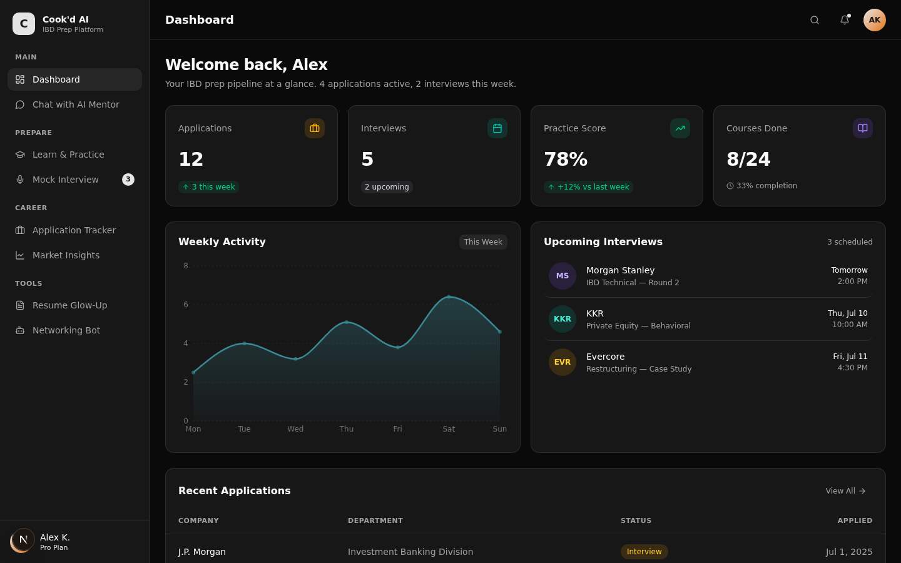

# 🎯 Som AI - Investment Banking Division Interview Prep Platform

A comprehensive, full-stack Next.js application designed specifically for Investment Banking interview preparation. Built with React 19, TypeScript, and modern web technologies.

**Developer**: [gunal200516](https://github.com/gunal200516)



## 🚀 **Live Demo**
- **Development**: `http://localhost:3000`
- **Features**: 8 fully functional pages with AI-powered interactions

## ✨ **Key Features**

### 🏠 **Interactive Dashboard**
- Real-time analytics and progress tracking
- Visual charts showing weekly activity and performance
- Upcoming interview schedule with company details
- Smart insights and daily focus recommendations
- Quick action buttons for immediate tasks

### 🤖 **AI Chat Mentor** 
- Context-aware conversation system
- IBD-specific guidance and coaching
- Quick prompts for technical, behavioral, and market questions
- Persistent chat history with intelligent responses

### 📚 **Learning Platform**
- 6 comprehensive IBD prep courses
- Interactive flashcard system with spaced repetition
- Progress tracking and performance analytics
- Quiz mode with detailed scoring

### 🎤 **Mock Interview System**
- 3 ready-to-use interview scenarios (Technical, Behavioral, Case Study)
- Realistic interview flow with timer and scoring
- Detailed performance feedback and improvement suggestions
- Question-specific tips and expert advice

### 📋 **Application Tracker**
- Kanban board view with drag-and-drop functionality
- Detailed list view with sorting and filtering
- Contact management for recruiters and networking
- Timeline tracking for applications and follow-ups

### 📊 **Market Insights**
- Industry hiring trends and salary data
- League table rankings and deal flow analysis
- Real-time market updates and sector performance

### 📄 **Resume Optimizer**
- AI-powered resume analysis and scoring
- ATS optimization with keyword suggestions
- Banking-specific language enhancement
- One-click PDF export with professional formatting

### 💼 **Networking Bot**
- AI-generated personalized outreach emails
- Template library for different scenarios (cold outreach, follow-ups, thank you notes)
- Contact tracking with response monitoring
- Informational interview preparation scripts

## 🛠️ **Technology Stack**

### **Frontend**
- **Next.js 16.2.10** (App Router with RSC)
- **React 19** with TypeScript
- **Tailwind CSS** for responsive styling
- **ShadCN UI** component library
- **Recharts** for interactive data visualization
- **Lucide React** for consistent iconography

### **Backend**
- **Next.js API Routes** for serverless functions
- **Prisma ORM** with SQLite database
- **RESTful API** design with full CRUD operations
- **TypeScript** for end-to-end type safety

### **Database Schema**
```prisma
model User {
  id        String   @id @default(cuid())
  name      String
  email     String   @unique
  plan      String
  createdAt DateTime @default(now())
}

model Application {
  id          String   @id @default(cuid())
  company     String
  position    String
  status      String
  appliedAt   DateTime
  department  String?
  location    String?
}

// + 9 more comprehensive models
```

## 🚦 **Getting Started**

### **Prerequisites**
- Node.js 18+ 
- npm or yarn package manager

### **Installation**

1. **Clone the repository**
   ```bash
   git clone https://github.com/gunal200516/Mock-Interview-agent.git
   cd Mock-Interview-agent
   ```

2. **Install dependencies**
   ```bash
   npm install
   ```

3. **Set up environment variables**
   ```bash
   cp .env.example .env.local
   # Edit .env.local with your configuration
   ```

4. **Initialize database**
   ```bash
   npx prisma generate
   npx prisma db push
   npm run db:seed
   ```

5. **Start development server**
   ```bash
   npm run dev
   ```

6. **Open in browser**
   ```
   http://localhost:3000
   ```

## 📖 **Usage Guide**

### **Dashboard Navigation**
- **Dashboard (/)**: Overview of all activities and progress
- **Chat (/chat)**: Interactive AI mentor conversations
- **Learn (/learn)**: Course content and practice flashcards
- **Mock Interview (/mock-interview)**: Simulated interview experiences
- **Tracker (/tracker)**: Application and contact management
- **Insights (/insights)**: Market data and hiring trends
- **Resume (/resume)**: Resume optimization and analysis
- **Networking (/networking)**: Outreach email generation and tracking

### **API Endpoints**
```typescript
// Real-time dashboard data
GET /api/dashboard

// AI chat interactions
POST /api/chat

// Application management
GET|POST|PUT /api/applications

// Performance tracking
GET|POST /api/practice-scores

// Networking contacts
GET|POST|PUT /api/networking
```

## 🎨 **Project Structure**

```
src/
├── app/                    # Next.js App Router pages
│   ├── api/               # API route handlers
│   ├── chat/              # Chat interface page
│   ├── learn/             # Learning platform page
│   └── ...                # Other feature pages
├── components/            # React components
│   ├── dashboard/         # Dashboard-specific components
│   ├── chat/              # Chat interface components
│   ├── ui/                # Reusable UI components (ShadCN)
│   └── ...                # Feature-specific components
├── lib/                   # Utility functions and API client
└── hooks/                 # Custom React hooks

prisma/
├── schema.prisma          # Database schema definition
├── seed.ts               # Sample data generation
└── db/                   # SQLite database file

public/
├── logo.svg              # Application logo
└── ...                   # Static assets
```

## 🔧 **Available Scripts**

```bash
# Development
npm run dev          # Start development server
npm run build        # Create production build
npm run start        # Start production server

# Database
npm run db:generate  # Generate Prisma client
npm run db:push      # Push schema to database
npm run db:seed      # Seed database with sample data

# Code Quality
npm run lint         # Run ESLint
npm run type-check   # Run TypeScript compiler
```

## 📊 **Features Deep Dive**

### **Dashboard Analytics**
- **Statistics Cards**: Applications (12), Interviews (5), Practice Score (78%), Courses (8/24)
- **Activity Chart**: Weekly progress visualization using Recharts
- **Interview Calendar**: Upcoming interviews with company branding
- **Quick Actions**: Direct access to key features

### **AI Chat System**
- **Context Awareness**: AI understands user progress and goals
- **IBD Expertise**: Specialized knowledge in investment banking topics
- **Conversation Memory**: Persistent chat history across sessions
- **Smart Suggestions**: Pre-built prompts for common scenarios

### **Learning Management**
- **Course Progress**: Visual tracking across 6 IBD preparation courses
- **Flashcard System**: Spaced repetition with difficulty adjustment
- **Performance Analytics**: Score tracking and improvement trends
- **Category Organization**: Technical, Behavioral, and Market Knowledge

## 🚀 **Performance & Quality**

### **Build Status**
- ✅ **Zero TypeScript errors**
- ✅ **Zero ESLint violations** 
- ✅ **Production build successful**
- ✅ **All API endpoints functional** (HTTP 200)
- ✅ **Database properly seeded**
- ✅ **Responsive design tested**

### **Code Quality Standards**
- **Clean Architecture**: Well-organized component structure
- **Type Safety**: Full TypeScript coverage throughout
- **Consistent Styling**: Unified design system with Tailwind CSS
- **Error Handling**: Graceful failure management
- **Performance**: Optimized with Next.js best practices

## 🌟 **Advanced Features**

### **Real-time Data**
- Live dashboard updates
- Dynamic progress tracking
- Interactive data visualizations

### **Professional UI/UX**
- Banking industry-appropriate design
- Intuitive navigation patterns
- Responsive across all device sizes
- Accessible component implementations

### **Extensibility Ready**
- **AI Integration**: Prepared for OpenAI/Claude API integration
- **Real-time Sync**: WebSocket infrastructure ready
- **Mobile Development**: API-first design enables mobile apps
- **Advanced Analytics**: Database schema supports complex queries

## 📄 **Documentation**

- [Complete Project Status](./COMPLETE_PROJECT_STATUS.md)
- [Dashboard Overview](./DASHBOARD_OVERVIEW.md)
- [Frontend Error Report](./FRONTEND_ERROR_REPORT.md)
- [API Documentation](./src/lib/api.ts)

## 🤝 **Contributing**

1. Fork the repository
2. Create a feature branch (`git checkout -b feature/amazing-feature`)
3. Commit your changes (`git commit -m 'Add amazing feature'`)
4. Push to the branch (`git push origin feature/amazing-feature`)
5. Open a Pull Request

## 📝 **License**

This project is licensed under the MIT License - see the [LICENSE](LICENSE) file for details.

## 🙏 **Acknowledgments**

- **Developer**: [@gunal200516](https://github.com/gunal200516)
- Built with [Next.js](https://nextjs.org/) and [React](https://react.dev/)
- UI components from [ShadCN/UI](https://ui.shadcn.com/)
- Icons from [Lucide React](https://lucide.dev/)
- Charts powered by [Recharts](https://recharts.org/)
- Database management with [Prisma](https://www.prisma.io/)

---

**🎉 Ready for immediate use, further development, or deployment!**

*Built for aspiring investment bankers who want to ace their interviews with confidence.*